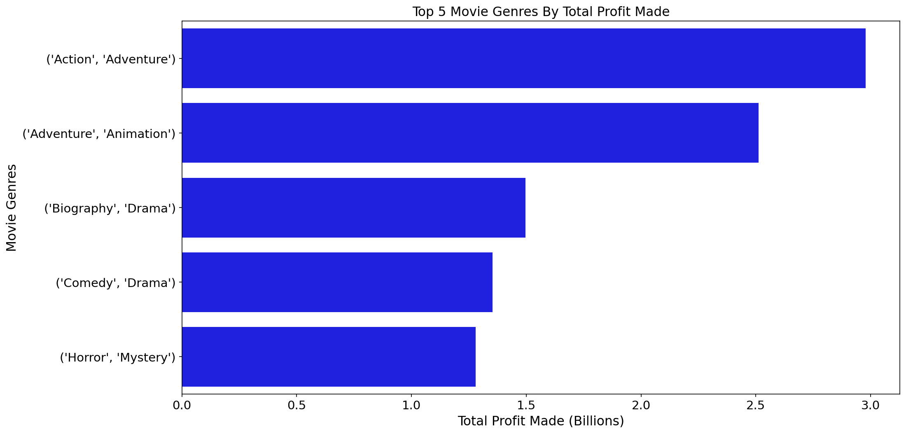
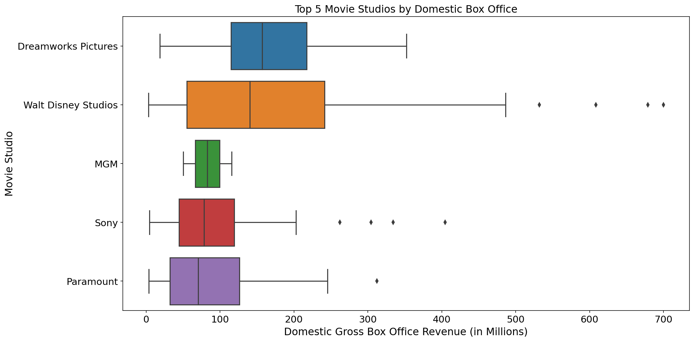
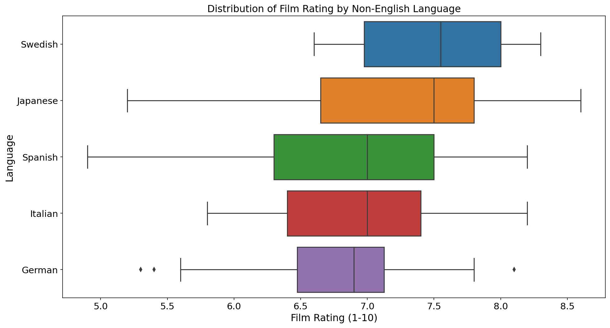

# Microsoft Movie Studio Film Industry Analysis

### Author: <a href="https://www.linkedin.com/in/pcontreras97//">Patricio Contreras</a>

## Overview

The purpose of this project is to help the newly formed Microsoft Movie Studio by performing an analysis of the movie industry.  We're particularly interested in identifying successful genres, possible movie studio partnerships, popular foreign-language films, and determine a most sucessful time of the year to release films.  Microsoft Movie Studio can use the results of this analysis to make data-driven decisions and optimise the production of their future movies.

## Business Problem

Microsoft sees all the big companies creating original video content and they want to get in on the fun. They have decided to create a new movie studio, but they don’t know anything about creating movies. They're very interested in knowing more about the movie industry and start off strong in such a competitive field.  In order to do this, this project will focus on gathering data and analysing the following:

* The most successful movie genres in terms of profit made
* The top 5 movie studios to partner up with by domestic gross box office revenue
* Best non-English languages in terms of film rating
* Best time of the year to release a film by domestic gross box office revenue

## The Data

In the folder `zippedData` are movie datasets from:

* Box Office Mojo
* IMDB
* Rotten Tomatoes
* TheMovieDB.org

This project uses the data provided from Box Office Mojo, IMDb, and TheMovieDB.org.

## Methods

The analysis done for this project is mostly centred around descriptive statistics calculated from the data provided.  These metrics were useful in identifying popular genres, successful movie studios, highly-rated non-English films, and an optimal time to release a movie.

## Results

### What are the most successful movie genres in terms of profit made?

"Action" and "Adventure" are the two genres that generate the most profit.  Despite these genres standing out from the rest, "Drama" pairs well with "Biography" and "Comedy" and is included in the top 5:

### Which are the top 5 movie studios Microsoft could partner up with?

Dreamworks and Disney are the most successful movie studios in terms of domestic gross box office revenue.  Despite both movie studios having widespread distributions, they stand apart from the rest when it comes to revenue.

### Which non-English language yields the highest film ratings?

Films in Swedish or Japanese are the ones with higher ratings than all other languages, on average.  These two have higher median rating compared to the rest.

### When is the best time of the year to release a film?

Films released in the summer months (May, June, July) and the end of the year (November, December) have higher revenues.  Furthermore, end-of-the-year films have the highest rating, on average.

## Conclusions

The analysis done for the newly-formed Microsoft Movie Studio has led us to recommend the following:

* **When deciding what type of film to produce, go with action, adventure, or drama.** These genres are the most profitable.
* **Partner up with Dreamworks or Disney to ensure great earnings.** These two movie studios stand out from the rest in terms of domestic gross box office revenue.
* **If producing a non-English film, go with Swedish or Japanese.** Films spoken in these two languages were rated higher than other languages, on average.
* **Release films in the summer and end-of-the-year months for the highest revenue.** If film rating is more important, release at the end of the year.

### Next Steps

* **Investigate the popular genres released per time of the year.** This analysis could inform Microsoft Movie Studio when to release what type of film.
* **Identify most prominent genres per movie studio.** This way, Microsoft Movie Studio could see which movie studio is best at a particular genre.
* **Analyse the relationship between film runtime and rating (or box office revenue).**  Performing this analysis can help Microsoft Movie Studio decide on an appropriate runtime for their films.

## For More Information

To see the full analysis, check out [MovieProject](MovieProject.ipynb).  For a more concise presentation, take a look 